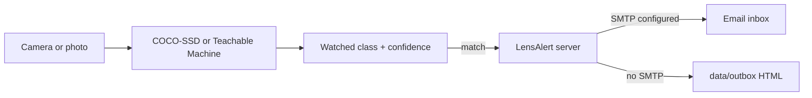

# LensAlert

A small web app that **recognizes objects in a camera feed or photo** and **emails you when a watched class appears**.

It is meant as a Teachable Machine community example: use the built-in object detector immediately, or point it at a model you trained at [Teachable Machine](https://teachablemachine.withgoogle.com/).



## What it does

- Live webcam monitoring or a one-shot image upload
- Built-in **COCO-SSD** detector (person, car, dog, and about 80 other objects) running in the browser with TensorFlow.js
- Optional **Teachable Machine image model** via the share URL from the Export panel
- Alert rules: watched classes, confidence threshold, cooldown
- Email with the class name, confidence, time, and an optional snapshot of the frame
- If SMTP is not configured, alerts are still saved as HTML under `data/outbox/` so you can try the full flow locally

## Run it

```bash
cd apps/image-alert
npm install
cp .env.example .env
npm start
```

Open [http://localhost:3847](http://localhost:3847).

1. Click **Load model** (COCO-SSD is the default).
2. **Start camera** or **Upload image**.
3. Set watched classes (default is `person`) and a confidence threshold.
4. Enter a recipient and optionally click **Send test email**.

Recognition happens in the browser. The Node server only stores history and sends mail.

## Email setup

Copy `.env.example` to `.env`. Without SMTP values, LensAlert writes each alert to `data/outbox/` instead of sending mail.

For Gmail, create an [App Password](https://support.google.com/accounts/answer/185833) and use:

```
SMTP_HOST=smtp.gmail.com
SMTP_PORT=587
SMTP_USER=you@gmail.com
SMTP_PASS=your-app-password
ALERT_FROM=LensAlert <you@gmail.com>
ALERT_TO=you@gmail.com
```

Restart `npm start` after editing `.env`.

## Teachable Machine models

1. Train an image model at [Teachable Machine](https://teachablemachine.withgoogle.com/).
2. Export → TensorFlow.js → shareable link.
3. In LensAlert, choose **Teachable Machine image model** and paste a URL like:

   `https://teachablemachine.withgoogle.com/models/MODEL_ID/`

4. Load the model, then watch the class names you trained (for example `mask` / `no mask`, `ok` / `spill`).

## Tests

```bash
cd apps/image-alert
npm test
```

The tests cover class matching, cooldown, snapshot validation, SMTP vs outbox delivery, and the HTTP API. They do not download TensorFlow models.

## Privacy notes

- Video never leaves the browser unless an alert fires and you opted to attach a snapshot.
- SMTP credentials belong in `.env`, not in source control.
- Use this only on cameras and photos you are allowed to monitor.
