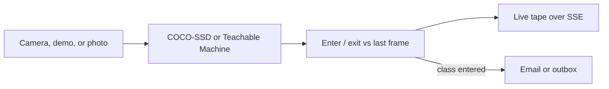

# LensAlert Monitor

A real-time monitoring app: watch a camera (or a demo feed), recognize objects in the browser, and **email an alert when a watched class enters the frame**.

It is a Teachable Machine community example. Use the built-in detector immediately, or point it at a model you trained at [Teachable Machine](https://teachablemachine.withgoogle.com/).



## What it does

- Control-room monitor with live HUD: uptime, FPS, frames, classes currently present
- **Arm camera** for real webcam monitoring, or **Start demo feed** (no camera or model required)
- Presence tracking: tape shows `ENTER person` / `EXIT person` instead of alerting on every frame
- Server-sent events so the live tape updates in real time
- 60-second hit sparkline
- Built-in **COCO-SSD** (person, car, dog, and ~80 objects) or a Teachable Machine image model
- Email on presence-enter, with optional snapshot; otherwise HTML is saved under `data/outbox/`

## Run it

```bash
cd apps/image-alert
npm install
cp .env.example .env
npm start
```

Open [http://localhost:3847](http://localhost:3847).

1. Click **Start demo feed** to see live enter/exit events immediately.
2. Or **Load model** then **Arm camera** for real recognition.
3. Watched class defaults to `person`. Emails fire when that class *enters*, then respect the cooldown.
4. Enter a recipient and optionally **Send test email**.

Recognition runs in the browser. The Node server keeps the live session, streams events, stores history, and sends mail.

## Email setup

Copy `.env.example` to `.env`. Without SMTP values, LensAlert writes each alert to `data/outbox/`.

For Gmail, create an [App Password](https://support.google.com/accounts/answer/185833) and use:

```
SMTP_HOST=smtp.gmail.com
SMTP_PORT=587
SMTP_USER=you@gmail.com
SMTP_PASS=your-app-password
ALERT_FROM=LensAlert <you@gmail.com>
ALERT_TO=you@gmail.com
```

Restart `npm start` after editing `.env`.

## Teachable Machine models

1. Train an image model at [Teachable Machine](https://teachablemachine.withgoogle.com/).
2. Export → TensorFlow.js → shareable link.
3. Choose **Teachable Machine image model** and paste:

   `https://teachablemachine.withgoogle.com/models/MODEL_ID/`

4. Load the model, then watch the class names you trained.

## Tests

```bash
cd apps/image-alert
npm test
```

## Privacy notes

- Video never leaves the browser unless an alert fires and you opted to attach a snapshot.
- SMTP credentials belong in `.env`, not in source control.
- Use this only on cameras and photos you are allowed to monitor.
